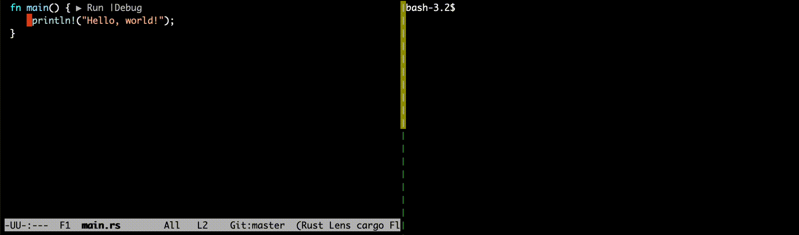

mamediff
========

[](https://crates.io/crates/mamediff)
[](https://docs.rs/mamediff)
[](https://github.com/sile/mamediff/actions)


A TUI editor for unstaged and staged Git Diffs.
This tool is inspired by [Magit] but is designed to be much simpler and specialized for editing diffs.

**NOTE: This tool is still under development (version 0.1.0 is scheduled for release in January 2025).**

[Magit]: https://github.com/magit/magit



Installation
------------

```console
$ cargo install mamediff
$ mamediff -h
```

Usage
-----

Just execute `mamediff` command within a Git directory.
The available key bindings will be displayed in the top-right corner of the window.

```console
$ mamediff
>| Unstaged changes (1 files)                      | (q)uit [ESC,C-c]
 :   modified src/main.rs (1 chunks, -0 +2 lines)  | (r)eload
 :     @@ -5,6 +5,8 @@ use mamediff::app::App;     | (↓)        [C-n]
 :        use orfail::OrFail;                      | (→)        [C-b]
 :                                                 | (t)oggle   [TAB]
 :        fn main() -> orfail::Result<()> {        | (s)tage
 :       +    println!("Hello World!");            | (D)iscard
 :       +                                         +---- (h)ide -----
 :            check_args().or_fail()?;
 :
 :            let app = App::new().or_fail()?;
 | Staged changes (0 files)
```
